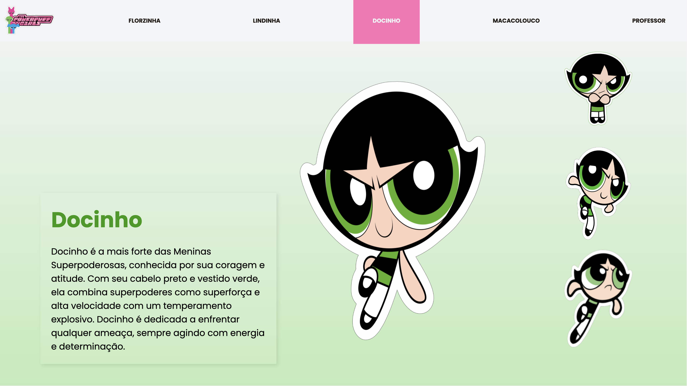

# Site Vertical - As Meninas Super Poderosas

---

## Sobre
Site estilo Landing page, primeiro contato com sites de rolagens/verticais, o site mostra os personagens do desenho animado as meninas super poderosas.
O intuito desse projeto é colocar em prática o conhecimento adquirido sobre as linguagens de marcaçao, CSS, HTML e Markdown, adquiridos por meio do curso técnico de desenvolvimento de sistemas do [SENAI Jandira](https://sp.senai.br/unidade/jandira/)

---

## Tecnologias Utilizadas
- HTML
- CSS
- Markdown
- Git

---

## Autora
- [Thayná de Oliveira Freire](https://www.linkedin.com/in/thayn%C3%A1-freire-863696297/)